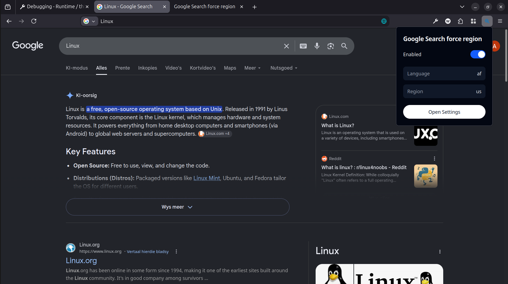
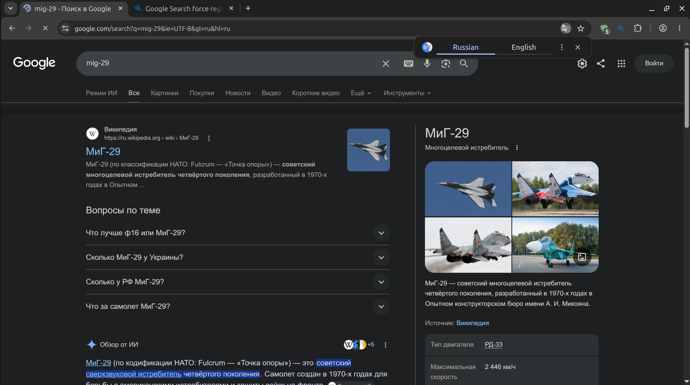
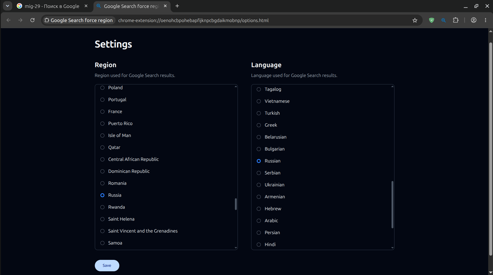

#  googlesearch-force-region
Chromium and Firefox extension for manually set the region and language used by Google Search

## Contents
- [How to use this extension](#how-to-use-this-extension)
- [How this extension work?](#how-this-extension-work)
- [Development](#development)
  - [Prerequisites](#prerequisites)
  - [Getting started](#getting-started)
  - [Available Scripts](#available-scripts)
- [Privacy policy](#privacy-policy)
- [License](#license)

-----





# How to use this extension
1. Install this extension via .zip file with developer mode or debug mode. .zip file can be found on [release](https://github.com/arfshl/googlesearch-force-region/releases/latest)

2. Toolbar pop-up can be used to enable/disable extension, see current region and languages, and entering main settings.

3. On main settings, you can choose region and languages from the table, the default settings is US region with English languages. Click "Save" to save your settings and don't forget to reload your Google Search tabs after it.

# How this extension work?
Beside user settings, Google Search define region and languange with URL parameter, `hl` for language, `gl` for region, with standard, two-letter ISO 3166-1 Alpha-2 format, for example `us` for United States region and `en`for english language. Full lists [here](https://github.com/arfshl/googlesearch-force-region/blob/main/region-data.js)

This extension uses `declarativeNetRequest` API and its slatic rules to intercept the search queries to `www.google.com` and adds those URL paramaters, allowing language and region to be defined and remembered without logging-in to your account or changing user settings regularly. Practically useful for VPN users or users who simply doesn't want to login when using Google Search.

# Development
### Prequisites
1. Node.js 20+
2. `zip` and `unzip`
3. Chromium-based and Firefox-based browser for testing

### Getting started
1. Clone the Repository
```bash
git clone https://github.com/arfshl/googlesearch-force-region.git
cd googlesearch-force-region
```

2. Install dependencies
```bash
npm install
```

3. Build the extension
```bash
npm run build # for both chromium and firefox
npm run build:chromium # for chromium
npm run build:firefox # for firefox
```

### Available Scripts
| Command | Description |
| ------- | ----------- |
| `npm run build` | Build extension with .zip format for both chromium and firefox |
| `npm run build:chromium` | Build extension with .zip format for chromium |
| `npm run build:firefox` | Build extension with .zip format for firefox |
| `npm run css` | Build extension options.html and popup.html CSS styling with TailwindCSS |

# Privacy Policy
This extension doesn't use any external services to operate, all functionality are running locally inside your browser, no data is sent or collected by me as developer.

In order to operate, this extension need access to:

1. "Block content on any page" - `declarativeNetRequest` API: For adding region and language URL parameters
2. "Access browser tabs" / "Read your browsing history" - `chrome.tabs`: This is actually just accessing active tabs which opening `www.google.com`, for auto-reloading on extensions enable/disable switch, and for open extensions settings page in a new tab
3. Local extension storage - `chrome.storage.local`: Used to store the extension settings, including the enabled/disabled state, selected region, and selected language.

# License
[GPLv3](https://github.com/arfshl/googlesearch-force-region/blob/main/LICENSE)